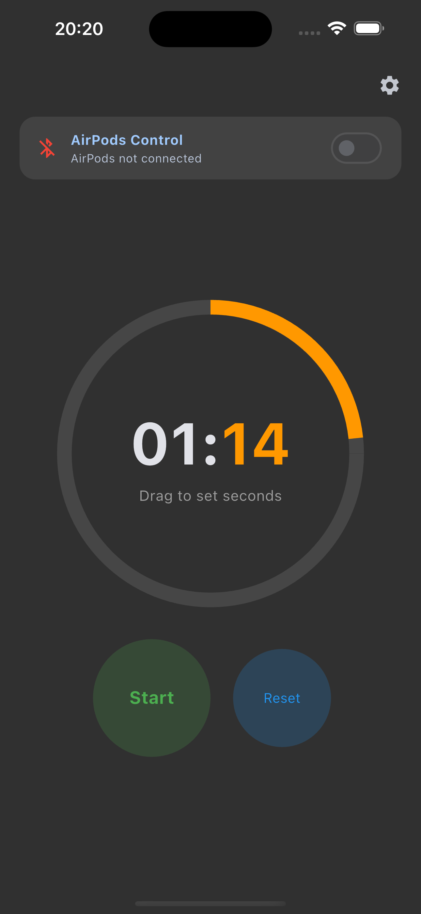
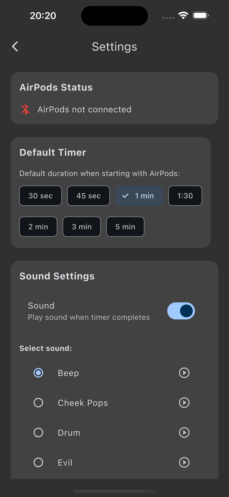

# AirPods Timer

A hands-free gym workout timer that can be controlled with AirPods without interrupting your music playback.

## Features

- **Hands-free Control**: Control your timer with AirPods taps while your phone stays in your pocket
- **Music Compatible**: Works alongside your favorite music apps without interruption
- **Customizable Timers**: Set any duration with an intuitive circular interface
- **Preset Timers**: Quick access to common gym interval times
- **Audio Alerts**: Choose from various notification sounds when your timer completes
- **Dark Mode**: Easy on the eyes during night workouts
- **Background Operation**: Timer continues even when your phone is locked

## How It Works

AirPods Timer runs silently in the background while detecting AirPods controls:

- **Single Tap**: Start/Pause/Resume timer
- **Double Tap**: Stop timer
- **Long Press**: Reset timer

## Packages Used

This app is built with Flutter and uses the following packages:

- **flutter_riverpod**: ^2.4.0 - State management
- **freezed_annotation**: ^2.4.1 - Code generation for immutable classes
- **get_it**: ^7.6.0 - Dependency injection
- **audio_service**: ^0.18.10 - Background audio handling
- **flutter_blue_plus**: ^1.14.1 - Bluetooth connectivity for AirPods
- **just_audio**: ^0.9.34 - Audio playback
- **audio_session**: ^0.1.16 - Audio session management
- **shared_preferences**: ^2.2.0 - Local storage for settings
- **vibration**: ^1.8.1 - Haptic feedback
- **in_app_review**: ^2.0.6 - App store rating prompts

### Dev Dependencies

- **build_runner**: ^2.4.6 - Code generation
- **freezed**: ^2.4.2 - Code generation for immutable classes
- **flutter_lints**: ^2.0.2 - Linting rules

## Getting Started

1. Install the app
2. Connect your AirPods to your device
3. Enable AirPods Control in the app
4. Set your desired timer duration
5. Start your workout!

## Requirements

- iOS 14.0 or later
- AirPods or other compatible Bluetooth headphones
- Bluetooth permissions

## Privacy

AirPods Timer respects your privacy:
- No data collection
- No network access
- No analytics

## License

This project is licensed under the MIT License - see the LICENSE file for details.
